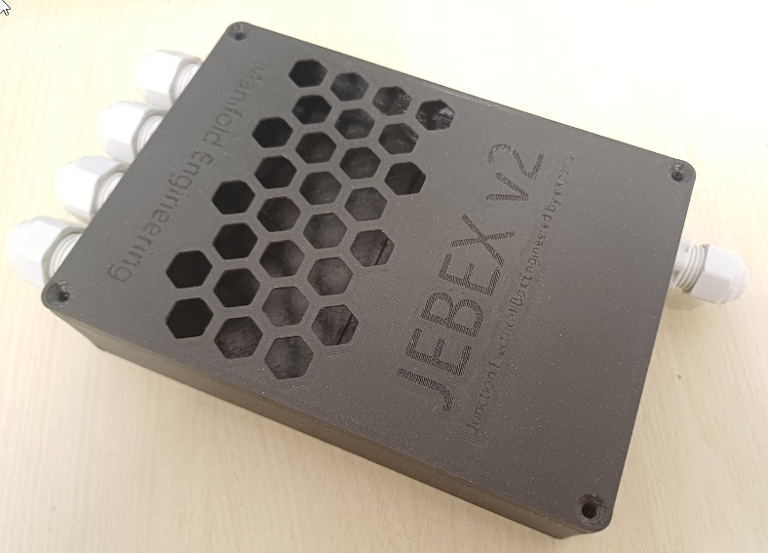
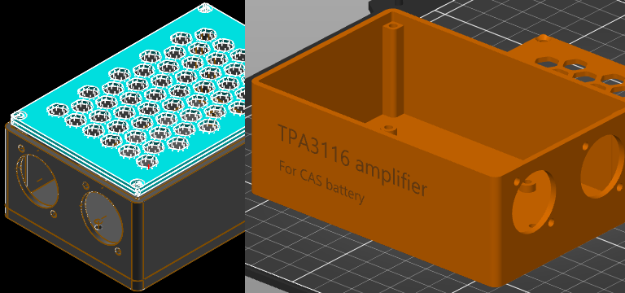

# Mechanical utilities
Sometimes, the simple things are what you need the most.
This repository contains set of our inhouse designed small mechanical stuff we needed to solve some niche, audio-engineering related problem and found worth sharing.

Some projects are meant to be manufactured using modern machinery (like rack panel - CNC laser cutter and CNC sheet metal brake press). In this case, usually .step files are provided.

Often, projects are meant to be 3D printed. In that case, .stl or .obj mesh files are provided. If there is .3mf file, use [Prusa Slicer](https://www.prusa3d.com/page/prusaslicer_424/). Most 3D printed parts were tested with Prusa mk IV printer, but probably other printers would work as well.

Designs were made either using [SolveSpace](https://solvespace.com/index.pl) or [FreeCAD](https://www.freecad.org/).

## JEBEX v2
### Junction Electrical Box Engineered by eXperts

3D printed enclosure for eletrical cables. Intended for lightweight live audio racks.

Features:
 - Designed for standard PG9 / PG7 cable glands
 - Height 30 mm (suitable for installation on the side of rack mounted devices)
 - Designed for MeanWell RS-25-12 (or similar) DC power supply
 - Typical use: multiple wireless reciever and a small network appliance (such as Mikrotik hEX...)
 - No built in electrical junction terminals. Use standard WAGO or similar.

## Rack Panel

Proffesional A/V devices often comes in 19" rack format. For creating neat portable setups, connector panles are crucial. There are many readily available panels with various connector types and counts, features for cable tying, rack U heights from various companies lile Adam Hall or Thomann. But we did not really find a panel, that would suit our needs perfectly.

Introducing: Manifold Rackpanel

Features:
 - Standard 1U 19" size
 - In-plane part (2 D-format cutouts, 4 BNC cutouts
 - recessed section (12 D-format cutouts, 2 BNC cutouts)

Our rackpanel is pimarily intended for portable wireless microphone systems. Recessed part allows for cable connectors (standard straight XLR, powercon...) to be left in panel while the rack lid is closed.

It is meant to be manufatured out of 1.5mm sheet metal.

## AkuAmp

Sometimes, small, battery powered audio amplifier with standard professional grade connections comes in handy. Either for location recording "loud monitoring", small scale PA use or whenever electrical outlet is not simply available.

Manifold AkuAmp solves this.
It allows you to neatly combine inexpensive material (cordless tools battery plate adapters, Chinese TPA3116 amplifier modules).

(real photo will add later)

## License

These projects are open-source under the MIT License — feel free to use, modify, and improve.